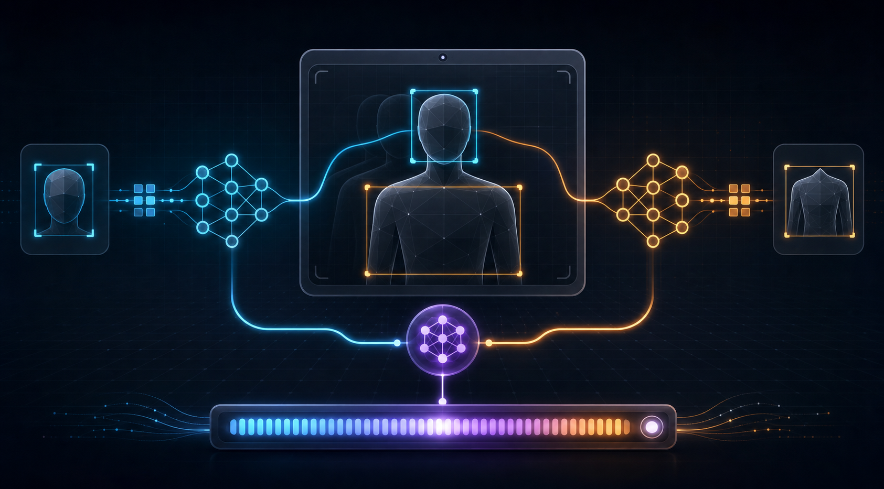
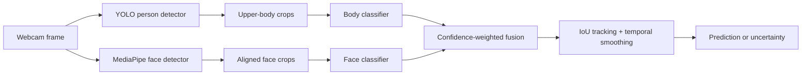

<div align="center">

# Real-Time Gender Fusion

**A research-oriented webcam demo that combines face and upper-body classifiers with confidence-weighted fusion, lightweight tracking, and temporal smoothing.**

[](https://github.com/Djordje3002/realtime-gender-fusion/actions/workflows/ci.yml)




</div>

## Why this project exists

Single-frame classifiers flicker, fail when a face turns away, and often hide uncertainty behind a confident label. This project makes those limitations visible. It detects people and faces independently, scores the available crops, weights each signal by its detection quality, tracks people across frames, and abstains when the result is not confident enough.

The repository includes a small face checkpoint (`gender_model.pt`) so the demo can run immediately after setup. A body checkpoint is intentionally not bundled; train one from PA-100K or pass your own compatible checkpoint to enable true face + body fusion.

## Features

- Face detection through MediaPipe Tasks and person detection through YOLOv8n
- Batched PyTorch inference for every face and upper-body crop in a frame
- Confidence- and face-size-weighted model fusion
- Lightweight IoU tracking with a rolling prediction average
- Configurable uncertainty threshold instead of forced classification
- Per-person scales, a primary-person gauge, and an optional debug overlay
- Automatic CUDA → Apple Silicon MPS → CPU device selection for inference
- Training scripts with subgroup and viewpoint evaluation tables

## Pipeline



## Quick start

### 1. Clone and install

Python **3.10–3.12** is recommended because MediaPipe wheels are available for those versions.

```bash
git clone https://github.com/Djordje3002/realtime-gender-fusion.git
cd realtime-gender-fusion

python3 -m venv .venv
source .venv/bin/activate        # Windows: .venv\Scripts\activate
python -m pip install --upgrade pip
python -m pip install -r requirements.txt
```

### 2. Check the camera with the minimal demo

```bash
python webcam.py
```

This uses MediaPipe plus the bundled face checkpoint and avoids the YOLO dependency at runtime. Press `q` to quit.

### 3. Run the fused pipeline

```bash
python realtime_fused.py
```

On the first run, MediaPipe may download its ~220 KB face detector and Ultralytics may download YOLOv8n. Because `body_model.pt` is not bundled, the program prints a notice and continues with the face classifier. Add a compatible body checkpoint to the project root to activate both streams.

## Useful commands

| Goal | Command |
| --- | --- |
| Face-only camera check | `python webcam.py` |
| Full interface with available models | `python realtime_fused.py` |
| Explicit face-only mode | `python realtime_fused.py --body-weights ""` |
| Use both trained checkpoints | `python realtime_fused.py --body-weights body_model.pt` |
| Show only the large primary gauge | `python realtime_fused.py --scale primary` |
| Show only per-person scales | `python realtime_fused.py --scale person` |
| Hide confidence scales | `python realtime_fused.py --scale off` |
| Widen the uncertainty band | `python realtime_fused.py --min-conf 0.75` |
| Select another camera | `python realtime_fused.py --camera 1` |

Runtime keys:

- `q` — quit
- `f` — toggle face/body weights and per-model predictions

## Train the models

Datasets and checkpoints are excluded from Git to keep the repository small and to avoid redistributing third-party data.

### Face model: UTKFace

Download the **Aligned & Cropped Faces** release of UTKFace and extract it so the image names follow `[age]_[gender]_[race]_[timestamp].jpg.chip.jpg`.

```bash
python train.py --data ./UTKFace --epochs 6
```

The default output is `gender_model.pt`. At the end of training, the script reports accuracy by ethnicity × encoded gender in addition to the overall validation score.

### Body model: PA-100K

Download PA-100K with `annotation.mat` and its image directory, then run:

```bash
python train_body.py --data ./PA-100K --epochs 8
```

The default output is `body_model.pt`. The loader supports both the original and common Kaggle directory layouts, and evaluation is split by front, side, and back viewpoints.

> Keep `UPPER_FRACTION = 0.5` in `train_body.py` synchronized with the default crop fraction in `fusion_core.py`. Training on full bodies and inferring on upper-body crops creates a severe domain mismatch.

## How fusion works

For each tracked person, the program assigns a reliability weight to every available classifier:

- The face stream is weighted by face-detector confidence and the face's pixel size.
- The body stream is weighted by person-detector confidence and a conservative discount because body cues are generally less reliable.
- Weighted probabilities are averaged, then smoothed over the track's recent frames.
- If the largest probability is below `--min-conf`, the UI returns **uncertain** instead of forcing a label.

The tracker is intentionally small and dependency-free. It is suitable for a webcam demo; for crowded scenes, long occlusions, or crossing trajectories, replace it with a production tracker such as ByteTrack.

## Project layout

```text
.
├── assets/                 README artwork
├── realtime_fused.py       detection, model inference, and UI
├── fusion_core.py           tested geometry, fusion, and tracking logic
├── tests/                   deterministic core behavior tests
├── webcam.py               minimal face-only webcam demo
├── mp_face.py              MediaPipe Tasks wrapper
├── camutil.py              cross-platform camera opening helper
├── train.py                UTKFace face-model training
├── train_body.py           PA-100K upper-body training
├── gender_model.pt         bundled face checkpoint
├── requirements.txt        runtime and training dependencies
└── requirements-dev.txt    lightweight core-test dependencies
```

## Troubleshooting

**Camera will not open**

- macOS: enable camera access for Terminal (or your IDE) in **System Settings → Privacy & Security → Camera**, fully quit the app, and reopen it.
- Try another index with `--camera 1` or `--camera 2`; Continuity Camera can change device ordering.

**The body classifier is disabled**

This is expected until `body_model.pt` exists. Train it with `train_body.py`, provide another compatible checkpoint via `--body-weights`, or stay in explicit face-only mode with `--body-weights ""`.

**Inference is slow**

YOLO person detection is the main cost. Use `webcam.py` for the lightweight face-only path, reduce camera resolution, or run PyTorch with CUDA on a supported NVIDIA GPU.

## Responsible use

This is a research and educational demo, not a system for determining a person's identity or gender. Its binary output reflects labels encoded by the training datasets and cannot represent the full range of gender identities. Appearance-based classifiers can reproduce demographic and viewpoint biases, even when aggregate accuracy looks strong.

Do not use this project for access control, hiring, surveillance, eligibility, safety, or any other decision that affects a person. Keep the uncertainty band, inspect subgroup metrics, obtain consent from anyone on camera, and review the source datasets' terms before training or redistribution.

## Showcase artwork

The project hero was custom-generated for this repository to illustrate the two model streams, temporal signal processing, and confidence fusion. It intentionally uses an abstract silhouette, contains no real person, and makes no accuracy claim.
